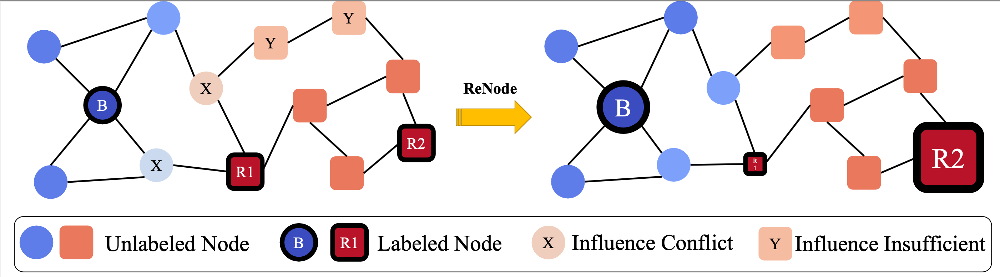

# Topology-Imbalance Learning for Semi-Supervised Node Classification

## Introduction
Code for NeurIPS 2021 paper "Topology-Imbalance Learning for Semi-Supervised Node Classification"


This work investigates the **topology-imbalance** problem of node representation learning on graph-structured data. Unlike the "quantity-imbalance" problem, the topology imbalance is caused by the topological properties of the labeled nodes, i.e., the locations of the labeled nodes on the graph can influence how information is spread over the entire graph.

The conflict-detection based metric **Totoro**  is proposed for measuring the degree of topology imbalance. 
Moreover, the **ReNode** method is proposed to relieve the topology imbalance issue for both transductive setting and inductive setting.


## Transductive Setting

### a) Introduction
The code for the transductive setting semi-supervised learning. 
Including the CORA/CiteSeer/PubMed/Photo/Computers experiment datasets as shown in paper. 
It is implemented mainly based on pytorch_geometric project: https://github.com/rusty1s/pytorch_geometric

### b) Quick Start
- Prepare conda enviroment; more package info can be found in "requirements.txt"
- Set the operations in 'opt.py'; some important operations are listed:
    1. Experiment Dataset (the dataset will be downloaded automatically at the first running time):
       set data_name = ['cora','citeseer','pubmed','photo','computers']
    2. Backbone GNN':\
       set model = ['sgc','ppnp','gcn','gat','sage','cheb']
    3. Training Loss:\
       set loss-name = ['ce','focal','re-weight','cb-softmax']
    4. ReNode Method:\
       set renode-reweight = 1/0 to open/close ReNode\
       set rn-base-weight as the lowerbound of the ReNode Factor\
       set rn-scale-weight as the scale range of the ReNode Factor
    5. Imbalance Issue:\
       set size-imb-type = 'none' if study TINL-only\
       set size-imb-type = 'step' if study TINL&QINL    
- Running command: 'python transductive_run.py'
      

##  Inductive Setting
### a) Introduction
The code for the inductive setting semi-supervised learning. Including the Reddit and MAG-Scholar datasets. It is branched from the PPRGo project: https://github.com/TUM-DAML/pprgo_pytorch.

### b) Quick Start 
- Prepare conda enviroment; more package info can be found in "requirements.txt"
- Prepare the dataset file from the following public source:
  1. Reddit: https://github.com/TUM-DAML/pprgo_pytorch/blob/master/data/get_reddit.md 
  2. MAG-Scholar:  https://figshare.com/articles/dataset/mag_scholar/12696653/2 


- Set the operations in 'config.yaml'; some important operations are listed:
  1. ReNode Method:\
      for baseline: set  base_w = 1 and scale_w = 0\
      for method:   set  base_w and scale_w 
  2. Training Size:\
      set ntrain_div_classes 
  3. Imbalance Issue: \
      set issue_type = 'tinl' if considering topology imbalance only\
      set issue_type = 'qinl' if jointly considering topology- and quantity-imbalance
  
- Running command: 'python inductive_run.py'

## License
MIT License

## Contact 
Please feel free to email me (chendeli96 [AT] gmail.com) for any questions about this work.
## Citation
```
@inproceedings{chen2021renode,
  author    = {Deli, Chen and Yankai, Lin and Guangxiang, Zhao and Xuancheng, Ren and Peng, Li and Jie, Zhou and Xu, Sun},
  title     = {{Topology-Imbalance Learning for Semi-Supervised Node Classification}},
  booktitle = {NeurIPS},
  year      = {2021}
}
```